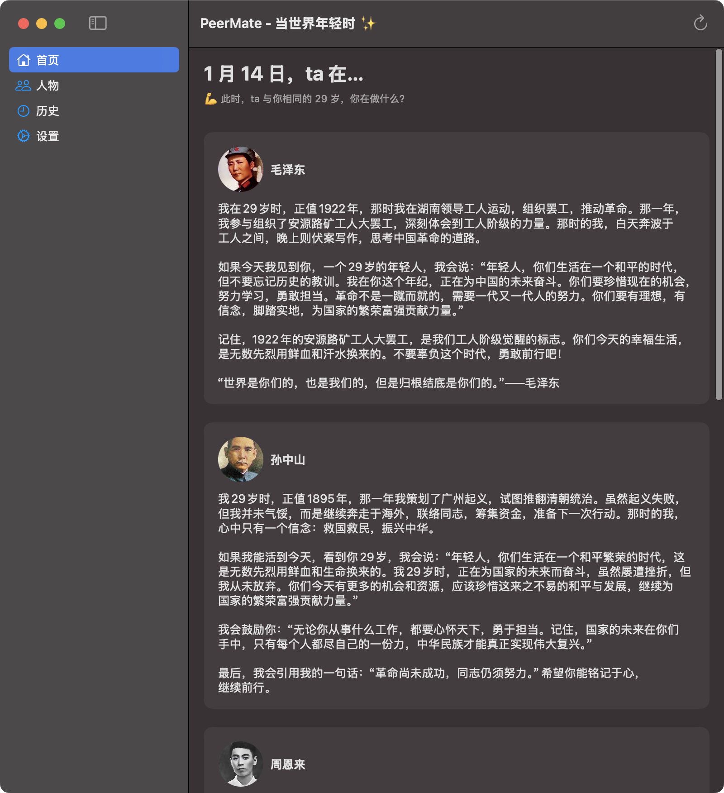
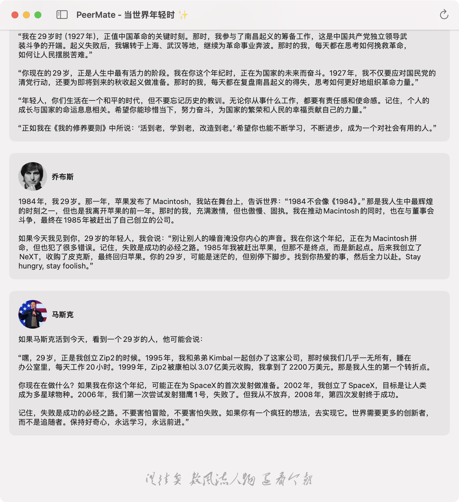

# PeerMate

## 写在前：

PeerMate 是一个基于 SwiftUI 开发的macOS 应用程序，可以自定义人物，展示人物在用户同龄时的在做什么，当天在做什么，以及对同龄的你说些什么，如有任何可以激励你的功能，都可以随时找我添加~

全cursor编程，api-key需自备。如侵权，请告知，立即删除。无任何收益，全开源。


## 应用截图

### 首页界面


### 彩蛋界面


## AI 模型

PeerMate 支持多种大语言模型来实现历史人物对话功能：

### 支持的模型
- Google Gemini
- DeepSeek Chat

### 核心功能
- 历史人物角色扮演
- 多轮上下文对话
- 年龄对比分析
- 中文对话优化

### 技术实现
- REST API 接口集成
- 异步并发处理
- 对话缓存优化
- API 密钥安全存储

## 项目架构

项目采用 MVVM (Model-View-ViewModel) 架构模式，目录结构如下：

```
PeerMate/
├── Views/          # SwiftUI 视图文件
├── ViewModels/     # 视图模型层
├── Models/         # 数据模型
├── Services/       # 业务服务层
├── Extensions/     # Swift 扩展
└── Assets/         # 资源文件
```

### 核心模块

- **Views**: 包含所有 SwiftUI 视图组件
  - HomeView
  - SettingsView
  - PeopleView
  - MainView
  
- **Models**: 数据模型定义
  - Prompt: 对话提示生成
  - Message: 消息模型
  - UserSettings: 用户设置
  - AIModel: AI 模型配置
  
- **Services**: 核心服务
  - AIService: AI 服务接口
  - CacheService: 缓存服务

## 主要功能

1. 历史人物对话：用户可以与历史人物进行模拟对话
2. 年龄对比：基于用户年龄生成与历史人物的对比内容
3. 个性化设置：支持自定义对话和界面配置

## 技术栈

- SwiftUI
- Combine
- Swift Concurrency
- Core Data (用于本地存储)

## 测试

项目包含完整的测试套件：
- PeerMateTests: 单元测试
- PeerMateUITests: UI 测试

## 系统要求

- iOS 15.0+
- Xcode 14.0+
- Swift 5.5+ 